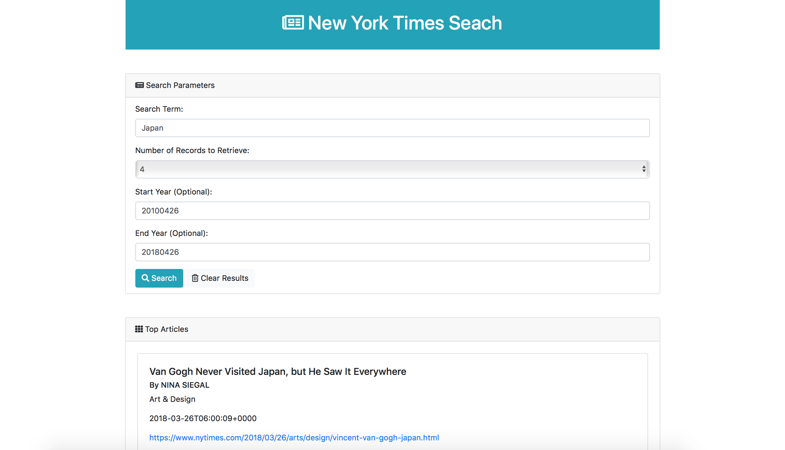

# New York Times App

### About The Project
This web app uses HTML, Bootstrap, Javascript, jQuery, APIs, and AJAX to scrape the New York Times website. Users can input a search term, the number of responses they'd like to receive, and a range of dates. The app will return a list of articles that match all of the user's parameters.

### To See The Project
Go to [this page](https://carmcollins.github.io/nyt-app/) and fill out the form to view results.

